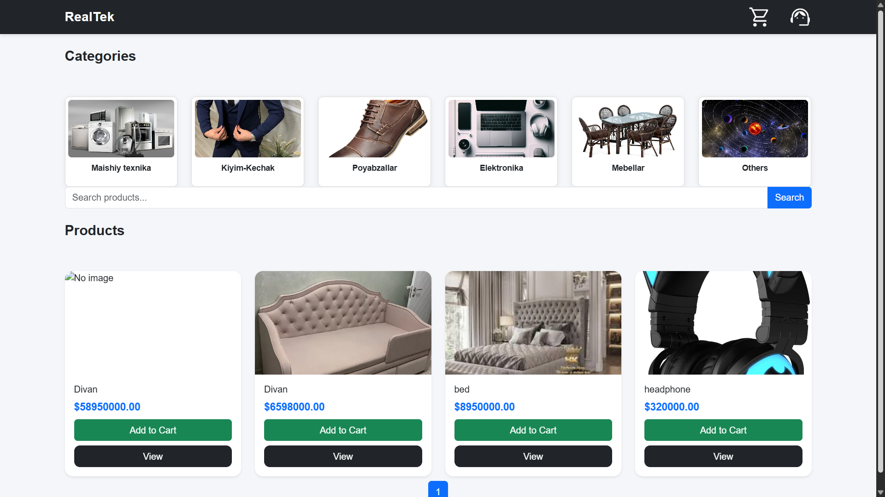
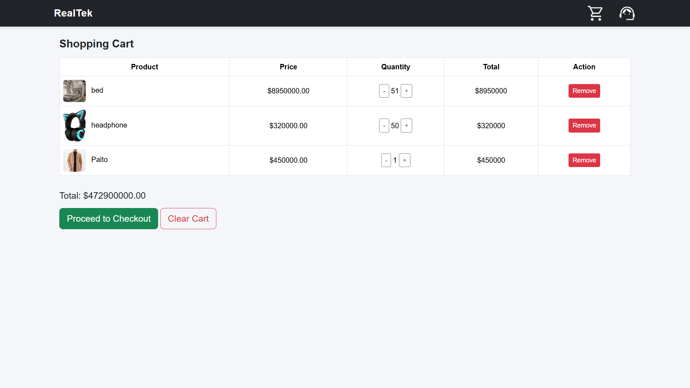
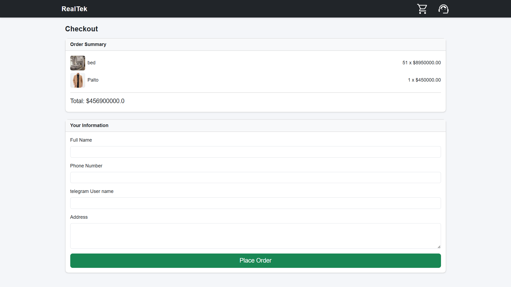
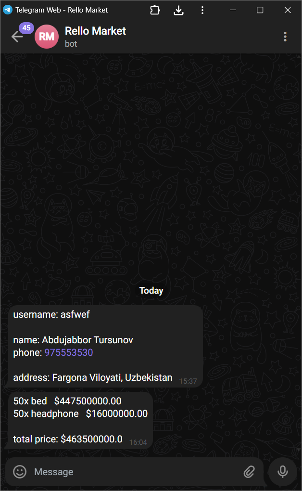
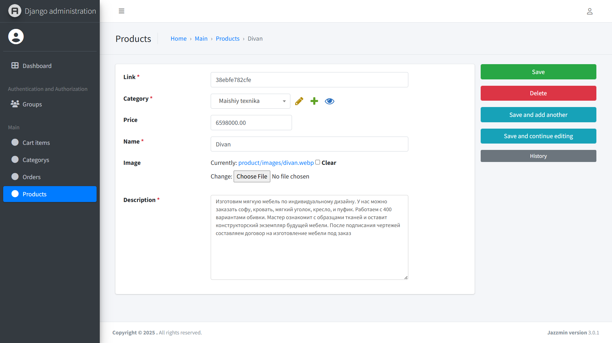
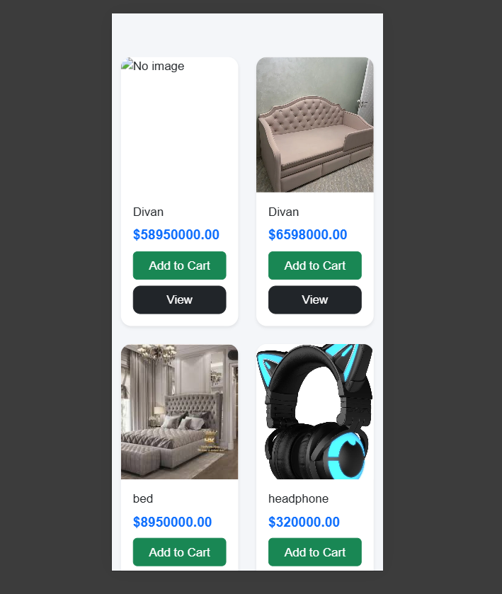
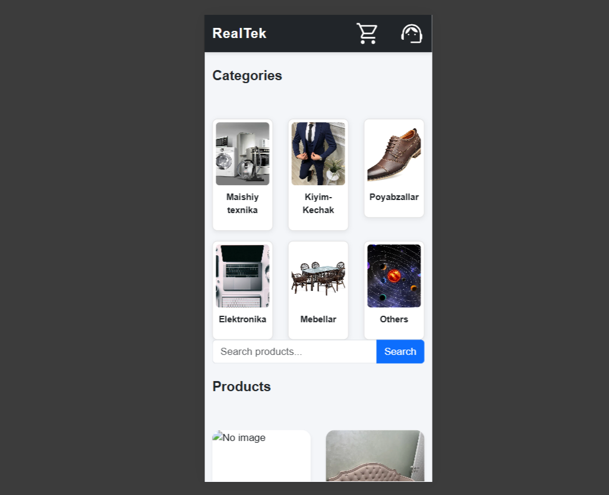

# 🛒 Rello Market  
A full-featured e-commerce system built with **Django**, **PostgreSQL**, and **Telegram Bot** integration.  
Rello Market allows users to browse products, add them to the cart, submit orders, and automatically notify the admin through Telegram.

---

# ⭐ Features

- 🗂 Category & Product management  
- 🛒 Cart system (add, remove, update quantity)  
- 📦 Order creation with user details  
- 🔔 Telegram admin notifications  
- 🛠 Django Admin Panel  
- 📱 Fully responsive UI  
- 🗄 PostgreSQL database  
- 🚀 Deploy-ready architecture  

---
## 📸 Screenshots

Below are sample UI previews of **Rello Market**:

### 🏠 Home / Catalog Page


---

### 🛒 Cart Page


---

### 📦 Order Page


---

### 🤖 Telegram Admin Notification


---

### 🛠 Admin Panel


---

### 📱 Mobile Responsive View




---

# 🧰 Tech Stack

### **Frontend**
- HTML5, CSS3, JavaScript  
- (Optional: React)

### **Backend**
- Django (recommended)  
- REST API (DRF optional)

### **Database**
- PostgreSQL (recommended)  
- MySQL support

### **Telegram Bot**
- Python (**telebot** or aiogram)

### **Hosting**
- PythonAnywhere / Render / VDS

---

# 🗄 Database Schema

### **Category**
| Field | Type |
|-------|------|
| id | int |
| name | varchar |

### **Product**
| id | category_id | name | price | image | description |

### **Cart**
| id | user_id | created_at |

### **CartItem**
| id | cart_id | product_id | quantity |

### **Order**
| id | user_name | phone | address | total_price | status |

### **OrderItem**
| id | order_id | product_id | quantity | price |

---

# 🎨 Frontend Overview

### **1️⃣ Catalog Page**
- Display all categories  
- Product image + name + price  
- “Add to Cart” button  
- Search + Filter system  

### **2️⃣ Cart Page**
- List added products  
- Quantity increase/decrease  
- Remove item  
- “Place Order” button  

### **3️⃣ Order Page**
- User fills:
  - Name  
  - Phone  
  - Address  
- After submission:
  - Admin receives Telegram notification  
  - User sees confirmation message  

### **4️⃣ Contact Page**
- Phone number  
- Telegram channel  
- Address  

---

# 🔗 REST API Endpoints

| Endpoint | Description | Method |
|----------|-------------|--------|
| `/api/categories/` | Get all categories | GET |
| `/api/products/` | Get products | GET |
| `/api/cart/add/` | Add item to cart | POST |
| `/api/cart/` | Get user cart | GET |
| `/api/order/create/` | Create order | POST |

---

# 🤖 Telegram Notification Integration

After an order is created, Django sends an instant notification to the admin:

```python
requests.post(
    f"https://api.telegram.org/bot{TOKEN}/sendMessage",
    data={
        "chat_id": ADMIN_ID,
        "text": order_text
    }
)
```

### **Message Format Example**
```
🆕 New Order  
Name: John Doe  
Phone: +998 90 123 45 67  
Products:
- iPhone 12 × 2 = 10,000,000  
Total: 12,500,000  
Address: Chilonzor, Tashkent  
```

### Admin Actions:
- View new orders  
- Press "Payment Received" button → Backend updates order status  

---

# 🛠 Admin Panel

Admin features:
- Add/Edit/Delete products  
- Manage categories  
- View all orders  
- Update order statuses  
- See users & cart items  

Built-in **Django Admin** makes management extremely easy.

---

# 📱 Mobile Optimization

- Responsive (Flex/Grid)  
- Adaptive buttons (100% width)  
- Burger menu for navigation  
- Optimized images (WebP recommended)  
- Simple and clean layout  

---

# 🚀 Deployment Guide

### **Backend Deployment**
- Host on PythonAnywhere / Render / VDS  
- Configure PostgreSQL  
- Run:
  ```bash
  python manage.py collectstatic
  python manage.py migrate
  ```

### **Frontend Deployment**
- GitHub Pages  
- Netlify  
- Vercel  
- Docker (optional)

### **Telegram Bot Deployment**
- Create bot using BotFather  
- Add bot token to `.env`  
- Host bot on:
  - PythonAnywhere  
  - Render  
  - Any VPS  

---

# 🧪 Testing Checklist

- Add to cart test  
- Order delivery test  
- Telegram notification test  
- Admin panel functionality  
- Mobile UI test  
- Image upload test  

---

# ✅ Final Outcome

With Rello Market you get:

✔ Product catalog  
✔ Shopping cart  
✔ Order system  
✔ Telegram admin notifications  
✔ Admin panel  
✔ Card-based manual payment  
✔ Fully responsive design  
✔ Deployment-ready application  

---

# 📄 License
No Authorized License

---

# 👨‍💻 Author
**Abdujabbor.T**  

